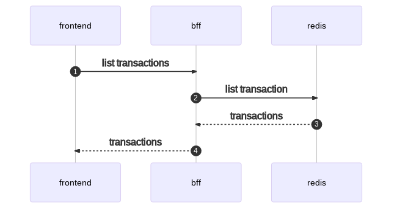

# Aula 1

## Contexto

Imagine que você acabou de entrar em um time de desenvolvimento de uma empresa de pagamentos digitais.

Você é responsável por manter um conjunto de sistemas que entregam a funcionalidade de registrar transações e depois consultar seu status. Utilize esse contexto para analisar os pontos a seguir.

Considere o diagrama da arquitetura dos componentes:


Considere os dois fluxos seguintes:

- Criar nova transação


- Listar transações



## Setup

O código fonte que implementa as funcionalidades descritas acima está nesse repositório. Utilize o código fonte e os materiais de apoio para responder os exercícios.

Para executar os sistemas, você precisa ter o `docker` e `docker-compose` instalados no seu computador.

1. Utilize [esse link](https://docs.docker.com/get-docker/) para baixar e instalar o `docker` no seu sistema.

2. Para executar todos os componentes do sistema, execute esse comando:

```
docker-compose up -d
```

Esse comando inicia os containers em segundo plano.

3. Verifique que os seguintes containers foram criados utilizando o comando:

```
- scylla-1
- scylla-2
- scylla-3
- redis
- kafka
- zookeeper
- envoy
- bff
- transactions
- antifraud-1
- antifraud-2
```

```
docker ps
```

4. Caso você necessite desligar algum container para responder as perguntas a seguir, execute o procedimento:

	4.1. liste os containers em execução:

	```
	docker ps
	```

	4.2. escolha o container que deseja parar, copie seu `CONTAINER ID` e execute:

	```
	docker kill -f <CONTAINER_ID>
	```


Exemplo:


## Prática

### Exercícios

1. Ainda é possível registrar transações quando uma das réplicas do `Cassandra` é desligada? E duas?

2. Quando o `Redis` está indisponível, ainda é possível consultar transações?

3. Caso o serviço `transactions` esteja fora do ar quando uma nova transação for publicada no kafka pelo `bff`, a transação será perdida? O que acontece quando `transactions` voltar ao ar?

4. Quais são as vantagens de transmitir os dados em Avro em vez de JSON do `bff` para o `Kafka`?

5. O `Kafka`, ao possibilitar o processamento assíncrono de transações pelo serviço `transactions`, permite com que o `bff` consiga responder com um __throughput__ maior, pois não é preciso esperar a latência do `Cassandra` e `antifraud`. Porém isso também traz suas desvantagens para a arquitetura. Liste duas desvantagens e justifique.

6. Analise o código do serviço de `transactions`. Quando o serviço `antifraud` estiver desligado, **ainda é possível registrar transações**? Qual vai ser o `status` final das transações nesse caso?

7. Quais são as **duas vantagens e desvantagens** de utilizar o envoy como __load balancer__ no contexto da interação entre os serviços `transactions` e `antifraud`?

8. O código enviar uma notificação de status por webhook para o `bff` está estruturado assim:

```python
def notify_status(transaction_id, status):
    try:
        resp = requests.patch(
            f"{BFF_HOST}/api/v1/transactions/{transaction_id}/status",
            json={"status": status},
        )

    except Exception as err:
        logging.error(f"failed to update status: {str(err)}")
        raise BFFStatusWebhookError(Exception)
```

8.1. Modifique esse código para que quando não for possível se comunicar com o serviço `bff`, continuar tentando enviar por mais 10 vezes antes de retornar um erro.

8.2. Ainda nesse contexto de interação entre os serviços `transactions` e `bff`, quais são as desvantagens de receber o status por __webhook__ para o `bff`?

## Materiais de apoio

- https://avro.apache.org/docs/current/#intro
- https://redis.io/documentation
- https://www.envoyproxy.io/docs/envoy/latest/
- https://docs.scylladb.com/architecture/architecture-fault-tolerance/
