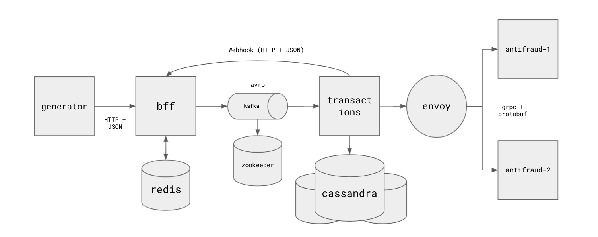

# Aula 1

Slides da aula [aqui](https://docs.google.com/presentation/d/1lri5OF3TuDglFLFER7bVzMRHAfslFjcWwMEraUbQSUk/edit?usp=sharing)

## Contexto

Imagine que você acabou de entrar em um time de desenvolvimento de uma empresa de pagamentos digitais.

Você é responsável por manter um conjunto de sistemas que entregam a funcionalidade de registrar transações e depois consultar seus status. Utilize esse contexto para analisar os pontos a seguir.

Considere o diagrama da arquitetura dos componentes:



Considere os dois fluxos seguintes:

- Criar transação


- Listar transações


## Setup

O código fonte que implementa as funcionalidades descritas acima está nesse repositório. Utilize o código, os materiais de apoio e o que mais julgar necessário para responder aos exercícios.

Para clonar esse repositório no seu computador, execute:

```
git clone https://github.com/felipemocruha/sistemas-distribuidos/
cd sistemas-distribuidos/aula-1
```

Para executar os sistemas, você precisa ter o `docker` e `docker-compose` instalados no seu computador.

1. Utilize [esse link](https://docs.docker.com/get-docker/) para baixar e instalar o `docker` no seu sistema.

2. Para executar todos os componentes do sistema, execute esse comando:

```
docker-compose up -d
```

Esse comando inicia os containers em segundo plano.

3. Execute o comando para listar os containers ativos:

```
docker ps
```

E certifique-se que os seguintes containers foram criados:

```
- scylla-1
- scylla-2
- scylla-3
- redis
- kafka
- zookeeper
- envoy
- bff
- transactions
- antifraud-1
- antifraud-2
- generator
```

## Dicas

### Desligar containers

Caso você necessite desligar algum container para responder as perguntas a seguir, execute o procedimento:

1. liste os containers em execução:

```
docker ps
```

2. escolha o container que deseja parar, copie seu `CONTAINER ID` e execute:

```
docker kill -f <CONTAINER_ID>
```

Exemplo:


Ou então pelo nome:

```
docker kill -f <CONTAINER_NAME>
```

Exemplo:

```
docker kill -f bff
```

### Exibir logs de um container

```
docker logs -f <CONTAINER_NAME>
```

Exemplo:

```
docker logs -f transactions
```

### Criar uma transação manualmente pela API:

- Para criar uma transação manualmente, execute o seguinte comando substituindo para os valores que desejar:

```
curl -X POST http://localhost:5001/api/v1/transactions \
	--data '{"value_in_cents":39859385,"description":"patinho de borracha","customer_id":"c408a342-5c78-4e31-afc8-c7c710b07340","merchant_id":"0f3eaa5d-79eb-48bc-ad0d-c775efa3646e","transaction_timestamp":1624079756,"latitude":93.1334,"longitude":12.0445}' \
	-H "Content-Type: application/json"
```

### Listar as transações do bff

```
curl -X GET http://localhost:5001/api/v1/transactions
```

Se tiver o `jq` instalado, assim fica mais bonito:

```
curl -X GET http://localhost:5001/api/v1/transactions | jq
```

### Inspecionar as transações salvas no banco de dados

Execute o seguinte comando para abrir o shell de um dos containers do scylla:

```
docker exec -ti scylla-1 cqlsh
```

Para listar as transações salvas:

```
USE transactions;
SELECT * FROM transactions;
```

### Inspecionar mensagens no kafka

Após instalar o [kafkacat](https://github.com/edenhill/kafkacat), execute:

```
kafkacat -b localhost:29092 -t transaction_created -o beggining
```

### Desligar todos os containers

```
docker-compose down
```

---

## Prática

Antes de começar os exercícios, pegue um tempo para se familiarizar com os componentes e com a operação do docker, isso vai facilitar bastante seu entendimento depois.

### Exercícios

1. Ainda é possível registrar transações quando uma das réplicas do `Cassandra` é desligada? E duas? Por quê?

2. Quando o `Redis` está indisponível, ainda é possível consultar transações? Justifique.

3. Caso o serviço `transactions` esteja fora do ar quando uma nova transação for publicada no kafka pelo `bff`, a transação será perdida? O que acontece quando `transactions` voltar ao ar?

4. Quais são as vantagens de transmitir os dados em Avro em vez de JSON do `bff` para o `Kafka`?

5. O `Kafka`, ao possibilitar o processamento assíncrono de transações pelo serviço `transactions`, permite com que o `bff` consiga responder com um __throughput__ maior, pois não é preciso sofrer a latência do `Cassandra` e `antifraud`. Porém isso também traz suas desvantagens para a arquitetura. Liste duas desvantagens e justifique.

6. Analise o código do serviço de `transactions`. Quando o serviço `antifraud` estiver desligado, ainda é possível registrar transações? Qual vai ser o `status` final das transações nesse caso?

7. Quais são as **duas vantagens e desvantagens** de utilizar o envoy como __load balancer__ no contexto da interação entre os serviços `transactions` e `antifraud`?

8. O código de enviar uma notificação de status por webhook para o `bff` está estruturado assim:

```python
def notify_status(transaction_id, status):
    try:
        resp = requests.patch(
            f"{BFF_HOST}/api/v1/transactions/{transaction_id}/status",
            json={"status": status},
        )

    except Exception as err:
        logging.error(f"failed to update status: {str(err)}")
        raise BFFStatusWebhookError(Exception)
```

8.1. Modifique esse código para que quando não for possível se comunicar com o serviço `bff`, continuar tentando enviar por mais 10 vezes antes de retornar um erro.

8.2. Ainda nesse contexto de interação entre os serviços `transactions` e `bff`, quais são as desvantagens de receber o status por __webhook__ no `bff`?

9. Cite algumas diferenças entre `Protocol Buffers` e `Avro`.

## Materiais de apoio

- https://avro.apache.org/docs/current/#intro
- https://redis.io/documentation
- https://www.envoyproxy.io/docs/envoy/latest/
- https://docs.scylladb.com/architecture/architecture-fault-tolerance/
