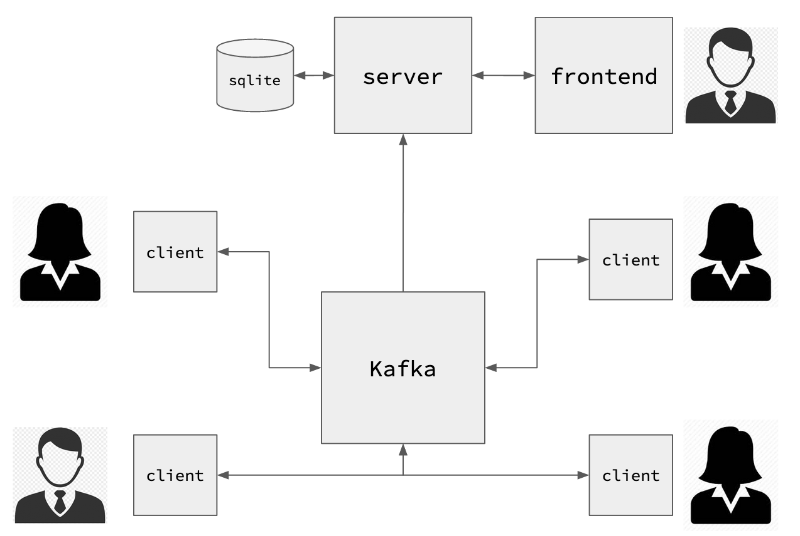

# Aula 4

Slides da aula [aqui](https://docs.google.com/presentation/d/1kwNjcnyR61KCu2scDRkkR66a6zbJUWUTgJzJDegjGJQ/edit?usp=sharing).


## Contexto

Você agora assume o papel de um(a) desenvolvedor(a) de uma aplicação de chat por texto.

Considere o diagrama da arquitetura dos componentes:



- **Server**: Responsável por gerenciar as contas de usuário e seus requisitos
- **Client**: Responsável por fazer a interação com os usuários do sistema de chat
- **Frontend**: Responsável por listar os usuários cadastrados no sistema
- **Kafka**: Responsável pela mensageria entre os diversos nós da rede
- **Sqlite**: Responsável por armazenar as contas de usuário criadas

## Setup

Para a atividade, só será necessário fazer o setup das dependências do `client`.

1. Clone esse repositório:

```
git clone https://github.com/felipemocruha/sistemas-distribuidos/
cd sistemas-distribuidos/aula-4
```

2. Assumindo que você já tem `python` e `virtualenv` instalados localmente, execute os seguintes comandos:

```
cd client
virtualenv -p python3 env
source env/bin/activate
pip install -r requirements.txt
```

Durante a aula, serão disponibilizadas as credenciais de acesso ao kafka.
Quando estiver com as credenciais em mãos:

```
cp .env.example .env
```

Em seguida modifique os valores do arquivo `.env` para os valores que você recebeu.

## Tarefa

Sua tarefa é implementar as funcionalidades para que seja possível criar contas de usuário, enviar e receber mensagens.

### a) Criação de conta

No arquivo `client/service/pubsub.py`, adicione a implementação do método `create_account` da classe `MessageClient` respeitando sua assinatura, para que seja possível criar uma conta de usuário.

Após implementar, para executar execute o seguinte comando:

```
python main.py create_account <seu_nome_de_usuario>
```

### b) Recebimento de mensagens

Agora é a hora de você implementar a funcionalidade de recebimento de mensagens.

No arquivo `client/service/pubsub.py`, adicione a implementação do método `receive_messages/handler` da classe `MessageClient` respeitando sua assinatura, para que as mensagens sejam imprimidas para `STDOUT`. Use a criatividade para que fique fácil de ler as mensagens que seus colegas vão te enviar =)

Para executar:

```
python main.py receive_messages
```

Deixe esse comando rodando em um terminal e utilize outro para o próximo passo.

### c) Envio de mensagens

Após criar uma conta, atualize novamente o arquivo `.env` na chave `KAFKA_MESSAGE_TOPIC` para refletir o identificador do seu usuário. Ele deverá seguir o seguinte padrão:

```
<seu_nome_de_usuario>_message_inbox
```

Exemplo:

```
felipemocruha_message_inbox
```

**São esperadas apenas letras minúsculas no nome!**

No arquivo `client/service/pubsub.py`, adicione a implementação do método `send_message` da classe `MessageClient` respeitando sua assinatura, para que seja possível criar uma mensagem para outro usuário.

Após implementar, modifique o payload correspondente no arquivo `client/main.py` com o conteúdo da mensagem que deseja enviar e também adicione o seu nome de usuário no campo `username`.

Para descobrir os nomes de usuário de seus colegas, acesse: https://alcantara.cloud

Para executar:

```
python main.py send_message <nome_de_usuario_destino>_message_inbox
```

Exemplo:

```
python main.py send_message fredy_message_inbox
```

---

Dica #1: Já estão declarados os schemas das mensagens, utilize-os para guiar o desenvolvimento.

Dica #2: os pontos de entrada dos scripts já estão na main, também utilize-os como base para a solução.

Dica #3: Você pode olhar o código dos componentes da `aula-1` para ter uma ideia de como utilizar os producers e consumers do kafka.
